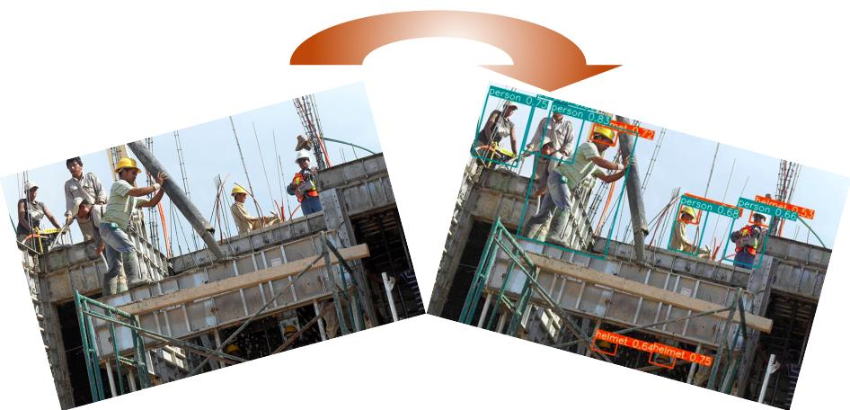

# Helmet detection

This repository is a clone of Ultralytics' open-source research into future object detection methods, namely Yolo V5. It could be used for helmet detection on persons.

## Inference

detect.py runs inference on a variety of sources, using the weights stored in `weights/best.pt`. The function `detect` within detect.py returns 3 outputs, `<image details>`, `<detection details>` and `<time of inference>`. The first two output parameters are strings and the last is a floating point number.

## WebApp

To see a running WebApp on Binder, click the following below and you do helmet and person detection on your own images!

For more comprehensive object detection, head to the Yolo V5 repo from Ultralytics.
